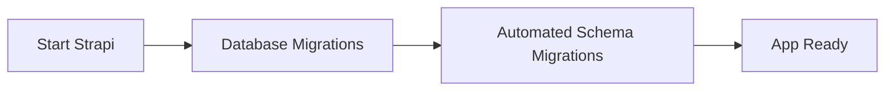
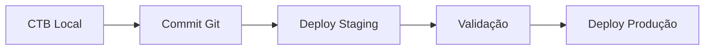
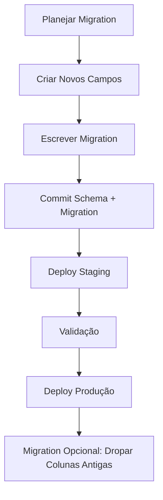

# 📘 Guia Profissional: Ambientes & Migrations no Strapi v5

> **Guia completo para configuração de ambientes, migrations e deploy profissional no Strapi v5**

---

## 🚀 0. Visão Geral Rápida

### 📋 **Fluxo Básico:**
1. **Modela** o schema localmente (CTB ou editando arquivos de schema)
2. **Versiona** no Git
3. **Deploy** para ambientes

### ⚙️ **Processo de Inicialização:**


- ✅ **Database Migrations** (se existirem) → executadas primeiro
- ✅ **Automated Schema Migrations** → sincronização do DB com schemas no código

### 🔒 **Produção:**
- CTB **desabilitado** por segurança
- Alterações estruturais devem vir do **código versionado**

### 🔄 **Transferência de Dados:**
- Use `strapi transfer` com **strict schema matching**
- Schemas devem ser **idênticos** entre origem e destino

---

## 🏗️ 1. Estrutura Essencial do Projeto (v5)

```
.
├─ config/
│  ├─ database.ts|js           # config do DB por ambiente
│  └─ admin.ts|js              # transfer.token.salt, etc.
├─ src/
│  ├─ api/
│  │  └─ <collection>/content-types/<collection>/schema.json
│  └─ components/
│     └─ <category>/<component>.json
├─ database/
│  └─ migrations/              # suas migrations one-off
├─ .env, .env.staging, .env.production
└─ package.json
```

### 📝 **Onde nascem as mudanças de schema?**

- **CTB** (em dev) ou editando diretamente os arquivos `schema.json`
- **Localização**: `src/**/content-types` e `src/components`
- **Produção**: esses arquivos são a **fonte da verdade** do schema

---

## 💻 2. Comandos Úteis

### 🔧 **Local (Desenvolvimento)**

```bash
# Inicializar projeto
npx create-strapi-app@latest my-app

# Rodar em desenvolvimento (CTB liberado)
yarn develop
# ou
npm run develop
```

### 🚀 **Build & Start (Staging/Produção)**

```bash
# Build de produção (gera admin e lê schemas)
NODE_ENV=production yarn build

# Start em produção (roda migrations custom e depois a sync automática)
NODE_ENV=production yarn start
```

### 🔄 **Transferência de Dados Entre Ambientes**

```bash
# No destino (ex.: staging), crie e copie o Transfer Token
# Settings → Transfer Tokens

# Depois, do ambiente origem:
strapi transfer --to=<dest-url> --to-token=<TRANSFER_TOKEN>
```

> ⚠️ **Importante**: O transfer exige schemas **idênticos** entre origem e destino

---

## 🗄️ 3. Configuração de Banco por Ambiente

### 📄 **config/database.ts** (exemplo com Postgres):

```typescript
export default ({ env }) => ({
  connection: {
    client: 'postgres',
    connection: {
      host: env('DATABASE_HOST', '127.0.0.1'),
      port: env.int('DATABASE_PORT', 5432),
      database: env('DATABASE_NAME', 'mydb'),
      user: env('DATABASE_USERNAME', 'strapi'),
      password: env('DATABASE_PASSWORD', 'secret'),
      ssl: env.bool('DATABASE_SSL', false),
    },
  },
});
```

### ✅ **Boas Práticas:**

- [ ] Use **variáveis de ambiente** por stage (`.env`, `.env.staging`, `.env.production`)
- [ ] Use o **mesmo engine** em todos os ambientes (ex.: Postgres)
- [ ] Garanta **permissão CREATE/ALTER** para o usuário do DB

---

## 🗃️ 4. Migrations no Strapi v5 (One-off Scripts)

### 📁 **Localização:** `./database/migrations`

### ⚡ **Execução:** Automática no boot, **antes** da sync automática

### 🎯 **Uso:** Preservar dados em mudanças destrutivas

---

### 4.1 ➕ **Adicionar Coluna com Backfill Seguro**

```javascript
// database/migrations/20250908_add_is_active_to_users.js
'use strict';

module.exports = {
  async up(knex) {
    // 1) adiciona a coluna (nullable ou com default seguro)
    const hasCol = await knex.schema.hasColumn('users', 'is_active');
    if (!hasCol) {
      await knex.schema.table('users', (t) => t.boolean('is_active').defaultTo(true));
    }

    // 2) backfill em dados existentes (idempotente)
    await knex('users').whereNull('is_active').update({ is_active: true });
  },
};
```

### 4.2 🔄 **"Renomear" Campo (Copiar Dados)**

> Como a sync automática não "move" dados de um campo para outro, faça via migration.

```javascript
// database/migrations/20250908_rename_username_to_display_name.js
'use strict';

module.exports = {
  async up(knex) {
    const hasNew = await knex.schema.hasColumn('users', 'display_name');
    if (!hasNew) {
      await knex.schema.table('users', (t) => t.string('display_name'));
    }

    // copia valores
    await knex('users').update('display_name', knex.ref('username'));

    // (opcional) numa migration futura, remover a coluna antiga com segurança
    // await knex.schema.table('users', (t) => t.dropColumn('username'));
  },
};
```

### 4.3 🔧 **Normalizar Tipos (String → Integer)**

```javascript
// database/migrations/20250908_cast_order_to_integer.js
'use strict';

module.exports = {
  async up(knex) {
    // cria coluna nova
    const hasCol = await knex.schema.hasColumn('articles', 'order_int');
    if (!hasCol) {
      await knex.schema.table('articles', (t) => t.integer('order_int'));
    }

    // tenta converter; valores inválidos viram null
    await knex('articles').update('order_int', 
      knex.raw("NULLIF(regexp_replace(order, '\\D', '', 'g'), '')::int"));

    // (depois) ajuste o schema do content-type para usar 'order_int'
    // e, em uma migration posterior, drope 'order'
  },
};
```

### 4.4 🔗 **Relação Renomeada (Pivot Table)**

```javascript
// database/migrations/20250908_copy_pivot_old_to_new.js
'use strict';

module.exports = {
  async up(knex) {
    // copia dados da tabela pivot antiga para a nova
    const existsOld = await knex.schema.hasTable('articles_tags_link');
    const existsNew = await knex.schema.hasTable('articles_topics_link');
    
    if (existsOld && existsNew) {
      const rows = await knex('articles_tags_link').select('article_id', 'tag_id');
      if (rows.length) {
        await knex.batchInsert('articles_topics_link',
          rows.map(r => ({ article_id: r.article_id, topic_id: r.tag_id })), 1000);
      }
    }
  },
};
```

> 💡 **Dica**: Mantenha suas migrations **idempotentes** (checar existência de colunas/tabelas)

---

## 🔄 5. Fluxo de Trabalho Recomendado

### 5.1 ✅ **Alterações Compatíveis** (adicionar campo, nova collection, índice)



**Passos:**
1. Faça a mudança no **CTB local** (ou edite `schema.json`)
2. **Commit** no Git
3. **Staging**: `yarn build && yarn start` → sync automática cria o que faltar
4. **Valide** e promova para produção

### 5.2 ⚠️ **Alterações Destrutivas** (renomear/remover/trocar tipo)



**Passos:**
1. **Planeje** a migration que preserva/move dados
2. **Crie** os novos campos/tabelas no CTB local
3. **Escreva** a migration em `database/migrations`
4. **Commit** de tudo (schema + migration)
5. **Staging**: build → start (migrations rodam antes da sync)
6. **Valide** e promova para produção
7. **(Opcional)** Migration posterior para dropar colunas antigas

### 5.3 🔄 **Conteúdo Entre Ambientes**

- Use `strapi transfer` com **Transfer Tokens** configurados no Admin
- Garanta **mesmo schema** nas duas pontas (é requisito)

---

## 🚀 6. Mini-Playbook CI/CD

### 📦 **Pipeline de Build**

```bash
# 1) Instalar deps
yarn --frozen-lockfile

# 2) Build (usa NODE_ENV=production)
NODE_ENV=production yarn build
```

### 🚀 **Release/Start**

```bash
# 3) Start (aplica migrations custom e depois sync automática)
NODE_ENV=production yarn start
```

### 🌍 **Variáveis de Ambiente**

Defina:
- `DATABASE_*`
- `APP_KEYS`
- `API_TOKEN_SALT`
- `ADMIN_JWT_SECRET`
- `TRANSFER_TOKEN_SALT`

### ✅ **Checklist Antes do Deploy**

- [ ] **Backup** do DB e dos assets
- [ ] **PR** com `schema.json` e possíveis migrations
- [ ] **strapi transfer** testado em staging (quando movendo conteúdo)
- [ ] **Permissões** do usuário do DB para DDL
- [ ] **Rollout** com feature flags/toggles se afetar frontend

---

## ❓ 7. Perguntas Frequentes

### 🤔 **"Adicionar um campo novo apaga meus dados?"**
**Não.** Adicionar coluna é aditivo; seus registros ficam intactos e a coluna nova vem nula ou com default. O risco está em **renomear/mudar tipo/remover** — nesses casos, crie migration para preservar/mover dados.

### 🤔 **"Posso editar schema no admin em produção?"**
**Não** — o CTB é desabilitado em produção; faça mudanças localmente + Git + deploy.

### 🤔 **"Qual a ordem no boot?"**
1. **Database migrations** em `database/migrations`
2. **Automated Schema Migrations** (sync do schema do código para o banco)

### 🤔 **"Como levo conteúdo de dev para prod?"**
Use `strapi transfer` com Transfer Tokens; lembre que o schema precisa ser **idêntico** nas duas pontas.

### 🤔 **"Deletar um content-type remove as entradas?"**
**Sim** — deletar um content-type no CTB remove as entradas associadas. **Cuidado!**

---

## 📋 8. Templates Prontos

### 8.1 📦 **Script NPM Recomendado**

```json
{
  "scripts": {
    "dev": "strapi develop",
    "build": "strapi build",
    "start": "strapi start",
    "start:prod": "NODE_ENV=production strapi start"
  }
}
```

### 8.2 🌍 **Exemplo de .env.production**

```env
NODE_ENV=production
DATABASE_CLIENT=postgres
DATABASE_HOST=...
DATABASE_PORT=5432
DATABASE_NAME=...
DATABASE_USERNAME=...
DATABASE_PASSWORD=...
APP_KEYS=...
API_TOKEN_SALT=...
ADMIN_JWT_SECRET=...
TRANSFER_TOKEN_SALT=...
```

---

## ⚡ 9. Quando Escrever Migration?

| Situação | Ação Necessária |
|----------|-----------------|
| 🔄 **Renomear** campo/tabela | ✅ Migration obrigatória |
| 🔧 **Trocar tipo** (string → int, JSON → relation) | ✅ Migration obrigatória |
| 📊 **Backfill** (popular novo campo com dados derivados) | ✅ Migration recomendada |
| 🔗 **Mover dados** entre estruturas (ex.: "tags" → "topics") | ✅ Migration obrigatória |
| 🧹 **Limpar/normalizar** dados antes de nova validação | ✅ Migration recomendada |

---

## 🔗 Links Úteis

- [Strapi 5 Documentation](https://docs.strapi.io/dev-docs/backend-customization/models#database-migrations)
- [Strapi Transfer Tool](https://docs.strapi.io/dev-docs/plugins/transfer)
- [Stack Overflow - Strapi Production](https://stackoverflow.com/questions/tagged/strapi)

---

> 💡 **Dica**: Mantenha este documento sempre atualizado conforme novas práticas e ferramentas forem implementadas no projeto.