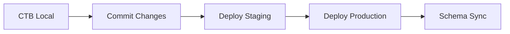
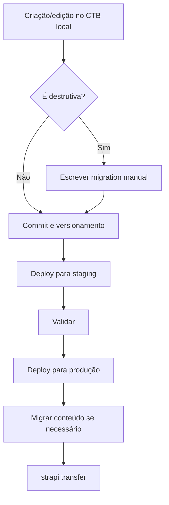
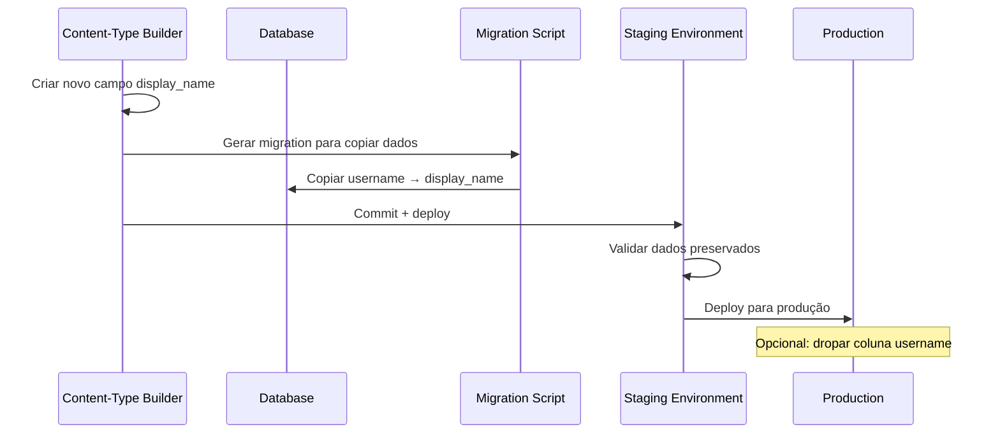

# 📘 Documentação de Ambientes e Migrations no Strapi v5

> **Guia completo sobre ambientes, sincronização de schema e migrations no Strapi v5**

---

## 🏗️ 1. Conceito de Ambientes

O Strapi trabalha com **ambientes distintos**, normalmente:

### 🔧 **Desenvolvimento (Local)**
- Onde você usa o **Content-Type Builder (CTB)** para criar/alterar schemas
- Ambiente de desenvolvimento e testes

### 🧪 **Staging**
- Ambiente intermediário para testes
- Mesmo schema da produção
- Validação antes do deploy final

### 🚀 **Produção**
- Ambiente final
- CTB desabilitado por padrão
- Apenas schema vindo do código-fonte é usado

### 📋 **Fluxo Profissional Recomendado**



1. **Criar/alterar** modelos no CTB local
2. **Commitar** as mudanças (`src/**/content-types` e `src/**/components`)
3. **Deploy** para staging/prod
4. **Inicialização**: `yarn build && yarn start` executa migrations e sincroniza schema

---

## ⚙️ 2. Sincronização Automática de Schema

### 🔄 **Quando a aplicação sobe:**

1. ✅ Executa **migrations custom** (`./database/migrations`)
2. ✅ Sincroniza automaticamente o schema do banco com base nos content-types

### 📊 **Exemplos de Comportamento:**

| Ação | Resultado | Status |
|------|-----------|--------|
| ➕ **Adicionar campo novo** | Cria coluna; dados existentes permanecem | ✅ Seguro |
| ➖ **Remover campo** | Coluna antiga continua no banco, mas não é usada; dados ficam "órfãos" | ⚠️ Cuidado |
| 🔄 **Renomear campo no CTB** | Interpretado como remover + adicionar → dados antigos não migram automaticamente | ❌ Perigoso |
| 🔧 **Alterar tipo de campo** | Pode causar erro ou perda de compatibilidade | ❌ Perigoso |

---

## 🗃️ 3. O que são Migrations no Strapi

### 📝 **Definição**
As migrations são **scripts de banco de dados** (`./database/migrations`) que rodam **antes** da sincronização automática.

### 🎯 **Propósito**
- ✅ Preservar dados em alterações destrutivas (renomear, remover, mudar tipo)
- ✅ Escrever lógica explícita para copiar, mover ou limpar colunas/tabelas
- ⚠️ **One-off**: cada arquivo roda uma vez e não há rollback automático

### 💻 **Estrutura de Migration**

```javascript
// ./database/migrations/20230908000000_rename_username_to_displayname.js
'use strict';

module.exports = {
  async up(knex) {
    // Copia os dados da coluna antiga para a nova antes da sync
    await knex.schema.table('users', (table) => {
      table.string('display_name');
    });

    await knex('users').update('display_name', knex.ref('username'));

    // (Opcional) depois você pode dropar a coluna antiga
    // await knex.schema.table('users', (table) => {
    //   table.dropColumn('username');
    // });
  },
};
```

---

## ⚠️ 4. Riscos de Perda de Dados

| Operação | Risco | Ação Necessária |
|----------|-------|-----------------|
| ➕ **Adicionar campo** | ✅ Seguro (desde que nullable/default) | Nenhuma |
| ➖ **Remover campo** | ⚠️ Dados permanecem no banco, mas inacessíveis | Migration opcional |
| 🔄 **Renomear campo via CTB** | ❌ Dados antigos não migram sozinhos | **Migration obrigatória** |
| 🔧 **Alterar tipo** | ❌ Pode causar incompatibilidade | **Migration obrigatória** |

> 🚨 **SEMPRE faça backup antes de alterações destrutivas!**

---

## 🚀 5. Processo Profissional Recomendado



### 📋 **Checklist:**
- [ ] Criação/edição de schemas no CTB local
- [ ] Commit e versionamento do código
- [ ] Se mudança destrutiva → escrever migration manual
- [ ] Deploy para staging e validar
- [ ] Deploy para produção
- [ ] Se necessário migrar conteúdo entre ambientes → usar `strapi transfer`

---

## 📋 6. Exemplo de Workflow Completo

### 🎯 **Caso: Renomear campo `username` → `display_name`**



### 📝 **Passos Detalhados:**

1. **No CTB**, cria um novo campo `display_name`
2. **Gera migration** (como no exemplo acima) para copiar os dados
3. **Commit + deploy** para staging
4. **Validar**: dados antigos foram preservados no novo campo
5. **Opcional**: dropar a coluna `username` em uma migration posterior
6. **Deploy** para produção

---

## ✅ 7. Boas Práticas

### 🏆 **Essenciais:**

- [ ] **Mesmo banco** (Postgres, MySQL, etc.) em todos os ambientes
- [ ] **Nunca editar CTB** em produção
- [ ] **Usar migrations** para preservar dados
- [ ] **CI/CD** com `build + start` para aplicar sync de schema
- [ ] **Backups regulares** antes de deploys

### 🛡️ **Segurança:**

- [ ] Sempre testar migrations em staging primeiro
- [ ] Documentar todas as alterações destrutivas
- [ ] Manter histórico de backups
- [ ] Usar transações quando possível

### 📚 **Organização:**

- [ ] Nomenclatura clara para migrations: `YYYYMMDDHHMMSS_description.js`
- [ ] Comentários explicativos no código
- [ ] Versionamento adequado do schema

---

## 🔗 Links Úteis

- [Strapi Documentation - Database Migrations](https://docs.strapi.io/dev-docs/backend-customization/models#database-migrations)
- [Strapi Transfer Tool](https://docs.strapi.io/dev-docs/plugins/transfer)
- [Knex.js Schema Builder](https://knexjs.org/guide/schema-builder.html)

---

> 💡 **Dica**: Mantenha este documento sempre atualizado conforme novas práticas e ferramentas forem implementadas no projeto.